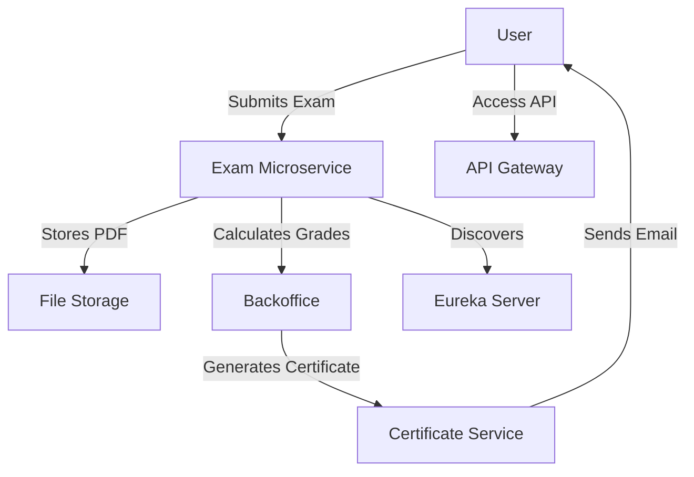

# 📄 Exam Management & Certificate Microservice

## 📌 Description

This microservice is part of a distributed system for **managing exams** and **generating certificates**. It is integrated with:

- 🎓 `Frontoffice` for students.
- 👨‍🏫 `Backoffice` for teachers.
- 🔍 **Eureka** for service discovery.
- 🌐 **API Gateway** for routing and security.

---

## 🛠️ Technologies Used

- **Java 17** & **Spring Boot 3**
- Spring Data JPA & Hibernate
- Spring Cloud Eureka (Client/Server)
- Spring Cloud Gateway
- Spring Mail (via Gmail SMTP)
- Feign Client (User Service Communication)
- MySQL
- Angular (Front & Backoffice Interfaces)
- PDF Generation (e.g., iText)

---

## 🧩 Project Structure

```
exam-microservice/
├── controllers/
├── entities/
├── services/
├── repositories/
├── client/
├── dto/
├── uploads/                # PDF storage
├── resources/
│   └── application.properties
├── frontend/
│   ├── frontoffice/        # Student interface (Angular)
│   └── backoffice/         # Teacher interface (Angular)
```

---

## 🚀 Features

- 📝 Create, submit, and grade exams.
- 🧮 Auto-detect pass/fail status.
- 🏆 Generate PDF certificates for passed exams.
- 📩 Send certificates by email.
- 📂 Secure file uploads and downloads.
- 🌐 Access endpoints via API Gateway.

---

## 💻 User Interfaces

### 🎓 Frontoffice (Student)
- Upload exam submissions in PDF format.
- View exam results and statuses.
- Download or receive certificates by email.

### 👨‍🏫 Backoffice (Teacher)
- View submitted exams.
- Assign grades and trigger certificate generation.
- Download and email certificates.

---

## 🧠 Eureka & API Gateway Integration

### `application.properties`

```properties
spring.application.name=microservice4
server.port=8050

# Eureka Configuration
eureka.client.service-url.defaultZone=http://localhost:8761/eureka
eureka.client.register-with-eureka=true

# MySQL Configuration
spring.datasource.url=jdbc:mysql://localhost:3306/user?createDatabaseIfNotExist=true&serverTimezone=UTC
spring.datasource.username=root
spring.datasource.password=
spring.jpa.hibernate.ddl-auto=update
spring.jpa.properties.hibernate.dialect=org.hibernate.dialect.MySQL8Dialect

# Email Configuration (use environment variables in production)
spring.mail.host=smtp.gmail.com
spring.mail.port=587
spring.mail.username=nessimayadi4@gmail.com
spring.mail.password=YOUR_APP_PASSWORD_HERE
spring.mail.properties.mail.smtp.auth=true
spring.mail.properties.mail.smtp.starttls.enable=true

# File Upload Limits
file.upload-dir=uploads/exams
file.certificate-dir=certificates
spring.servlet.multipart.max-file-size=10MB
spring.servlet.multipart.max-request-size=10MB
```

⚠️ **Security Tip**: Never hardcode credentials. Use environment variables or external configuration.

---

## 📡 API Endpoints (via API Gateway)

| Method | Endpoint | Description |
|--------|----------|-------------|
| **POST** | `/api/exams` | Create a new exam |
| **POST** | `/api/exams/{id}/submit` | Submit an exam |
| **POST** | `/api/exams/{id}/grade` | Grade an exam |
| **GET**  | `/api/exams/user/{userId}` | Retrieve exams for a student |
| **GET**  | `/api/exams/{id}/certificate` | Download a certificate |
| **GET**  | `/api/certificates/generate/{id}` | Generate a certificate manually |
| **POST** | `/api/certificates/send/{id}` | Send a certificate by email |
| **GET**  | `/api/exams/download/{filename}` | Download a PDF file |

---

## 📥 Example Request

```bash
curl -X POST http://localhost:8080/api/exams \
-F "exam={\"title\":\"Java Basics\",\"description\":\"Intro to Java\",\"userId\":2}" \
-F "file=@/path/to/exam.pdf"
```

---

## 🔒 Validation Rules

- ✅ Only `.pdf` files are allowed.
- ⛔ Max file size: 10MB.
- 🧠 State validation before grading or submission.
- 🔐 Path cleaning & secure downloads.

---

## 📁 File Storage

All PDFs (exams and certificates) are stored locally in the `uploads/` and `certificates/` folders. Ensure these directories exist and are writable.

---

## ⚙️ Installation & Execution

### Prerequisites
1. **Java 17** or higher.
2. **Maven** for dependency management.
3. **MySQL** for the database.
4. **Angular CLI** for modifying the user interfaces (optional).
5. Docker (optional for running services in containers).

### Steps
1. Clone the project:
   ```bash
   git clone https://github.com/nessimayadi12/exam-microservice.git
   cd exam-microservice
   ```

2. Configure the database in `application.properties`.

3. Build the project:
   ```bash
   mvn clean install
   ```

4. Run the microservice:
   ```bash
   mvn spring-boot:run
   ```

5. Access the API Gateway at `http://localhost:8080`.

6. (Optional) Run with Docker:
   ```bash
   docker-compose up
   ```

---

## 📊 Architecture Diagram



---

## 📝 License

This project is open-source under the MIT License. See the `LICENSE` file for more details.

---

Developed with ❤️ by the **Exam Management & Certificate Microservice** team.
